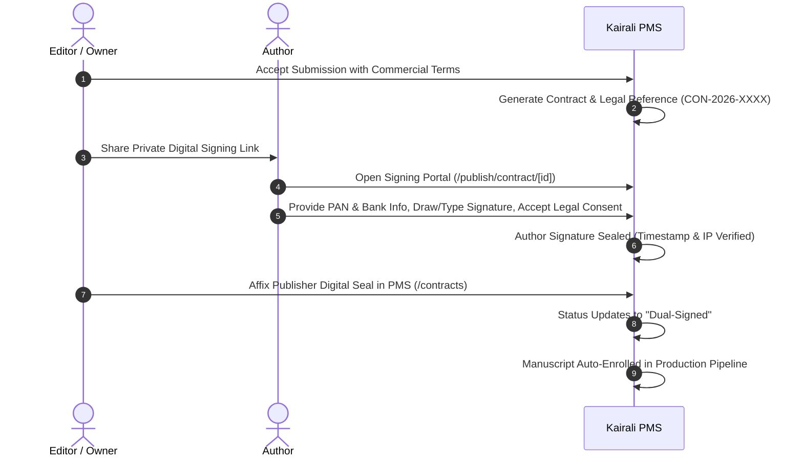

# Kairali PMS — User Guide & Operations Manual

Welcome to **Kairali PMS** (Publisher Management System), the digital publishing operations platform built for **Kairali Books** (Malayalam book publisher).

This guide covers the core end-to-end workflows across the system: from public manuscript submission and editorial review, to digital contract execution, DTP production, and team management.

---

## 1. System Roles & Access Levels

Kairali PMS operates on three focused publishing roles:

| Role | Primary Responsibilities | Default Access |
| :--- | :--- | :--- |
| **Owner** | Full publisher oversight, commercial terms approval, legal agreement digital signing, team management, and financial reporting. | All PMS features & settings |
| **Editor** | Manuscript submission review, editorial evaluation, decision-making (Accept / Reject / Revise), and pipeline handoff. | Submissions, Contracts, Production |
| **Production** | Typesetting, DTP layout, cover design review, galley proof verification, printer coordination, and stock receipt logging. | Production Pipeline, Print Jobs |

---

## 2. Public Author Submission & Self-Tracking Portal

Authors can submit manuscripts and track their publication status via clean, public-facing pages in English without needing to log in.

### 2.1 Submitting a Manuscript (`/publish`)
1. Visit **`http://localhost:3000/publish`**.
2. Read the publishing guidelines and click **"Submit Your Manuscript"**.
3. Fill out the submission form:
   - **Author Details**: Full Legal Name, Email, Phone, and Postal Address.
   - **Book Details**: Title, Malayalam Title, Literary Genre (Novel, Poetry, Essays, Biography, etc.), Language, Estimated Page Count, and Abstract/Synopsis.
   - **Files**: Upload Sample Manuscript (`.pdf`, `.docx`) and Optional Author Photo.
4. Submit the form to receive a unique **Tracking ID** (e.g. `KB-SUB-2026-0001`) and a direct tracking link.

### 2.2 Public Author Status Tracker (`/publish/status`)
- Authors can track their submission anytime using their **Tracking ID** or **Email Address**.
- The tracking dashboard provides live visual status updates:
  - `Pending Review` $\rightarrow$ `Under Editorial Review` $\rightarrow$ `Accepted (Contract Issued)` $\rightarrow$ `In DTP Production` $\rightarrow$ `Published`.

---

## 3. Editorial Submission Review Workflow (`/submissions`)

Editors and Owners evaluate submissions from the internal PMS dashboard:

1. Log in to the PMS at **`http://localhost:3000/login`**.
2. Navigate to **"Submissions"** in the sidebar.
3. Click on any submission to open the **Submission Detail View**:
   - Inspect author details, pitch, synopsis, and metadata.
   - Download or view the submitted manuscript file.
   - Reassign the reviewer or add internal editorial notes.
4. Click **"Submit Review Decision"**:
   - **Accept Submission**: Opens the Commercial Contract Generator.
   - **Request Revision**: Sends feedback notes to the author for manuscript improvements.
   - **Reject Submission**: Sends formal editorial decline with customized reasoning.

---

## 4. Contract Generation & Commercial Terms

When accepting a submission, the editor/owner configures the commercial terms for the legal agreement:

### 4.1 Publishing Tracks
- **Traditional (Kairali-Funded)**:
  - Publisher funds 100% of production and distribution.
  - **Royalty Rate (%)**: e.g., 10% to 15% calculated on **MRP** or **Net Realized Receipts**.
  - **Advance on Signing (₹)**: Optional advance against future royalties (e.g., ₹10,000.00).
- **Self-Publishing (Author-Funded)**:
  - Author funds typesetting and initial print run.
  - **Package Cost (₹)**: Base fee + **18% GST** breakdown automatically calculated.
  - Distribution copies and author stock allocation.

### 4.2 Standard Publishing Clauses
- **Complimentary Copies**: e.g., 10 free author copies upon release.
- **Author Discount**: e.g., 40% discount off MRP for additional author purchases.
- **Contract Duration**: 3 to 5 years exclusive print rights in Malayalam.

---

## 5. Digital Dual-Signing Workflow

Agreements are executed digitally under the Indian Information Technology Act, capturing timestamps, IP addresses, and user verification.

### 5.1 Author Digital Signing (`/publish/contract/[id]`)
1. The author opens their private contract link.
2. They review the complete 6 legal articles:
   - **Article 1**: Grant of Exclusive Rights.
   - **Article 2**: Commercial & Royalty Terms (Royalty %, Advance, Free Copies, Discount).
   - **Article 3**: Term & Exclusivity.
   - **Article 4**: Proofreading & 14-day Galley Proof Review Window.
   - **Article 5**: Copyright Retention & Reversion of Rights.
   - **Article 6**: Indian Tax Compliance (Section 194J TDS) & Jurisdiction (Kozhikode, Kerala).
3. **Fill Tax & Royalty Details**: PAN Number (for 194J TDS) and Bank Account/IFSC for royalty payouts.
4. **Signature Options**:
   - **Draw Signature**: Interactive touch/mouse drawing pad.
   - **Type Signature**: Stylized legal script authentication.
5. Check the legal declaration checkbox and click **"Accept & Digitally Sign Agreement"**.

### 5.2 Publisher Digital Signing & Verification (`/contracts`)
1. In the PMS, open **"Contracts"**.
2. Click **"View Agreement"** to inspect all terms, author PAN, and timestamped signature.
3. Click **"Publisher Sign"** $\rightarrow$ Affix Digital Seal.
4. Status transitions to **`Dual-Signed`**.

### 5.3 Author Galley Proof Review & In-Browser Preview Modal (`/author` & `/publish/status`)
Authors do not need to download files to their device. Clicking review files opens an interactive **In-Browser Document & Artwork Preview Modal**:

1. **Author Portal (`http://localhost:3000/author`)**:
   - Log into the Author Portal using your registered email and password.
   - Under **"Live Production Pipeline"**, your active book displays the **"Galley Proof Files & Final Layout Draft"** panel:
     - 👁️ **View Typeset Layout (PDF)**: Opens an embedded interactive PDF reader directly in the browser with page scroll and zooming.
     - 🎨 **View Full Cover Artwork**: Opens a high-resolution artwork viewer with matte backdrop to inspect front cover, spine width, back blurb, and barcode.
     - **Tab Switching**: Switch between interior layout and cover art without leaving the preview modal.
2. **Public Tracking Portal (`http://localhost:3000/publish/status`)**:
   - Access via manuscript Reference Number (`MAN-2026-XXXX`) and author email.
   - When the project reaches **Final Proof**:
     - Click **"View Typeset Layout (PDF)"** or **"View Book Cover Artwork"** to open the preview modal.
     - If changes are needed, submit typo/layout correction notes in the **Revision Feedback** box.
     - If approved, click **"Approve and Sign Off"** to digitally authenticate final author consent and advance the title to the printing press run.
3. **Anti-Download & Anti-Screenshot DRM Protections**:
   - **No File Downloads**: Direct download triggers and pop-out URLs are completely disabled. The server strictly streams inline responses with `Cache-Control: no-store`.
   - **Browser PDF Toolbar Suppressed**: Browser download and print buttons are hidden inside the embedded reader (`#toolbar=0`).
   - **Screenshot Shortcut Interception**: Attempts to press `PrintScreen`, `Win+Shift+S` (Windows Snipping Tool), or `Cmd+Shift+3/4` (Mac Screenshot) are intercepted, wiping the clipboard and briefly triggering a security warning.
   - **Focus Loss Shielding**: If the browser window loses focus (e.g. when an external screen recording or snipping tool is activated), the document preview automatically blacks out with a security shield until focus is regained.
   - **Copy & Drag Protection**: Right-click context menus (`Save image as...`) and drag-and-drop actions are blocked by an invisible security overlay.
   - **Dynamic Watermark**: A repeating diagonal confidential watermark bearing the author's reference and copyright notice is rendered across the viewer.

### 5.4 Two-Step ISBN Registration Workflow
The ISBN allocation stage is divided into two distinct operational steps:
1. **Step 1: ISBN Application Sent to National Agency**:
   - The assigned production staff or editor submits the book's bibliographic metadata to the Raja Rammohun Roy National Agency for ISBN.
   - In the PMS, enter the optional **Agency Application Reference / Acknowledgement Number** (e.g. `RRR-2026-KL-XXXX`).
   - Click **"Mark ISBN Request Sent to Agency"**.
   - The status updates to `🔵 Step 1 of 2: Application Sent · Awaiting Allocation` across all staff dashboards and author portals.
2. **Step 2: ISBN Allocation Accepted & Number Assigned**:
   - Once the national agency issues the official 13-digit ISBN:
   - Enter the allocated ISBN number (e.g. `978-81-981234-5-6`).
   - Click **"Confirm Allocation & Advance to Final Proof"**.
   - The PMS automatically records `isbn_registered`, updates the linked catalog record (`titles.isbn`), logs the audit trail, and unlocks the **Author Final Proof** milestone.

---

## 6. Official PDF & Print Export (`/contracts/[id]/print`)

- Click **"View Agreement"** $\rightarrow$ **"Print / Save Official PDF"** (or open `/contracts/[id]/print`).
- Renders a clean A4 printable document with:
  - Official **Kairali Books letterhead** (GSTIN, PAN, Rajaji Road, Kozhikode address).
  - Structured legal articles (1 through 6).
  - Certified dual digital signature verification stamps.
  - Automatic isolation from all web application UI, modals, and background tables.

---

## 7. Production & DTP Typesetting Pipeline (`/production`)

Once dual-signed, titles enter the active **Production Pipeline**:

1. Navigate to **"Production"** in the sidebar.
2. Track manuscript progress across pre-press production stages:
   - `DTP & Typesetting` $\rightarrow$ `Cover Design` $\rightarrow$ `Proofreading & Corrections` $\rightarrow$ `Author Galley Approval` $\rightarrow$ `ISBN Allocation & MRP Lock` $\rightarrow$ `Press Batching & Printing Run`.
3. **Flow 8b: Post-Production Intake & BMS Handover**:
   - **Press Delivery & Quality Check (QC)**: Record physical delivery count, paper/binding specs, and verify quality control inspection (with damage write-offs if any).
   - **Track-Aware Author Copies**:
     - *Kairali Books Publishing Track*: Earmarks contractual complimentary copies (default 10) for author handover.
     - *Self-Publishing Track*: Deducts custom author package copies from warehouse stock with optional courier tracking docket logging.
   - **Warehouse Intake**: Automatically calculates net commercial warehouse intake, updates `titles.stock` cache, and creates immutable `stock_movements` audit ledger rows.
   - **Multi-Channel Distribution**: Simultaneously activates the title across 4 sales channels:
     1. `Retail Bookstore`: Kozhikode stadium store POS and retail billing.
     2. `Dealer Network`: Regional distributors and bookstore orders.
     3. `Book Fairs`: Festival stalls and cultural exhibition inventory.
     4. `Online Catalog`: Direct consumer web portal orders.
   - **PMS to BMS Handover**: Final milestone seal transitioning the title to published state, live in store and sales channels.

---

## 8. Published Books & Titles Catalog (`/titles`)

Staff members (`Owner`, `Editor`, `Production`, `Accounts`, `Store`) can view, filter, and inspect the complete catalog of published books and printed titles:

1. Navigate to **"Published Books"** in the sidebar.
2. **Overview Statistics**:
   - **Catalog Titles**: Total count of registered titles.
   - **Warehouse Stock**: Live balance of all physical copies across warehouses.
   - **Inventory Valuation**: Aggregate retail value of all stock on hand.
   - **Low Stock Alerts**: Count of titles whose stock is at or below their reorder threshold.
3. **Search & Dynamic Filters**:
   - **Search Bar**: Instant keyword search across Book Title (English & Malayalam), Author, ISBN, or Edition.
   - **Genre Filter**: Filter by Novel, Poetry, Essays, Biography, Drama, etc.
   - **Inventory Status**: Filter by In Stock, Low Stock (≤ reorder), Out of Stock, or Out of Print.
4. **Interactive Sorting**:
   - Click column headers (**Book Title**, **Author**, **ISBN**, **MRP**, **Warehouse Stock**) to sort ascending/descending.
5. **Slide-Over Detail Drawer**:
   - Click any book row to open its specification drawer containing:
     - Bibliographic metadata (Pages, Binding, Edition, Category).
     - Pricing & Contract terms (MRP, Unit Cost, Royalty %, Advance).
     - Warehouse stock count & reorder thresholds.
     - Recent stock movement ledger entries (print receipts, sales deltas).
     - Direct jump link to its Production Pipeline project.

---

## 9. Team Management (`/team`)

Owners can manage staff members and assign roles:

1. Navigate to **"Team"** in the sidebar.
2. Click **"Add Team Member"** or edit existing staff.
3. Configure:
   - Full Name & Email Address.
   - Initial Password (stored securely with bcrypt).
   - Role Selection: **`Editor`**, **`Production`**, or **`Owner`**.
   - Active / Inactive status toggle.

---

## 10. Live Cloud Test Accounts & Credentials

| Role | Test Email | Password | Access URL |
| :--- | :--- | :--- | :--- |
| **Owner** | `owner@kairalibooks.in` | `kairali123` | `http://localhost:3000/dashboard` |
| **Editor** | `editor@kairalibooks.in` | `kairali123` | `http://localhost:3000/submissions` |
| **Production** | `press@kairalibooks.in` | `kairali123` | `http://localhost:3000/production` |
| **Published Books** | *Staff roles* | `kairali123` | `http://localhost:3000/titles` |
| **Public Portal** | *No login needed* | *N/A* | `http://localhost:3000/publish` |
